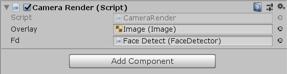
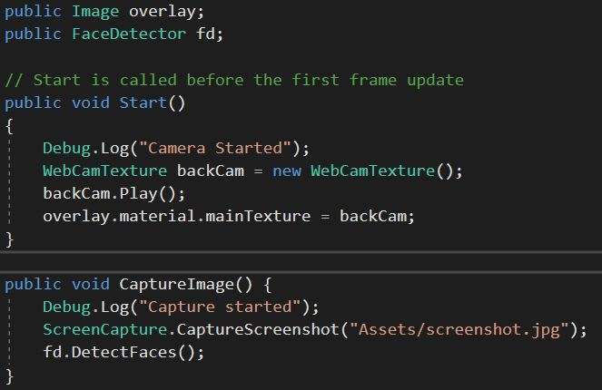

IBM Watson Facial Recognition
Installation Guide

Before we begin, make sure you have the following:
-   Unity (any version works, but I used 2018.3.0f2)
    -   Unity Hub preferred
-   Unity Watson SDK
-   IBM Cloud account
-   Computer with webcam/separate USB camera
-   Zip files of images of yourself and others
    -   positive_examples.zip: as many images as you can gather that have you in the picture, but can include both group photos and selfies; 100 images would be ideal but if you have less they should still work
    -   negative_examples.zip: images of friends or stock photos of various people to best train the classifier on when to not recognize you; 100 images would be ideal for this as well

1.  Project Installation Guide

    A.  IBM Watson Cloud
    
        1.  Navigate to the IBM Cloud webpage here:
            <https://tinyurl.com/y2h9zvaq>
        2.  Fill out your details and create a new IBM Cloud account, or login with an existing one
        3.  Once logged in, click the blue button labeled “Create Resource”
        4.  Scroll down the list to the “AI” category and click on “Visual Recognition”
        5.  You can leave the information as is, but you may change the “Service name” to something more suitable for your project
        6.  Select a pricing plan (I went with the Lite version), then click the blue “Create” button:
            1.  Lite – Free but can only create two custom models
            2.  Standard – Pay-per-use with unlimited models
        7.  Once created, navigate to your Dashboard
            1.  Three horizontal lines in top left -\> Dashboard
        8.  Under your Dashboard you should now see a “Resource summary” tab
        9.  Click on the “Services” link in “Resource summary”
        10. Under “Services”, click on the “Visual Recognition” service you created
        11. You are now set on the IBM Watson side of the project; make sure you can navigate to this page later to retrieve your
            credentials

    B.  Unity Watson SDK
    
        1.  Navigate to and download the Unity SDK package here:
            <https://tinyurl.com/yxol2ulf>
        2.  Extract the files to a temporary folder and keep the folder open
        3.  Launch Unity and create a new project
        4.  Once Unity is loaded navigate to File -\> Build Settings
            1.  Make sure the “Target Platform” is not set to Web Player or WebGL as it is not supported by the Watson SDK
            2.  Click “Player Settings” in the bottom left
            3.  Click on the “Other Settings” category
            4.  Change “Scripting Runtime Version” to “.NET 4.x equivalent”
        5.  Navigate to the folder where we previously extracted the “unity-sdk” folder
        6.  Move the folder straight into Assets in Unity and wait for it to import
        7.  Once the assets are imported you should get a message that the Watson SDK is now installed

    C.  Unity Scene Setup
    
        1.  Delete everything in the scene except the Main Camera; we leave that to prevent error messages on screen
        2.  Right click and Create Empty; name it to Face Detect as it will house our Face Detection script later
        3.  Right click and under UI click Canvas; an EventSystem is created with the Canvas to keep track of any interactions, 
            which you can leave as is
        4.  Right click and create another Empty; rename it to Camera Render as it will house the Camera Render script later
        5.  Right click on the Canvas and create a UI -\> Image; this image will hold our webcam information
        6.  Right click on the Canvas again and create a UI -\> Text; the text will show any pertinent information to the image
            classifier
        7.  Right click again on Canvas and create a UI -\> Button; the button will enable us to have a method to start and restart
            the Visual Recognition classifier
        8.  In Assets, navigate to Watson -\> Examples -\> Service Examples -\> Scripts and copy the ExampleVisualRecognition.cs 
            script into the top level of the Assets folder; rename it to FaceDetector.cs as we will use this script as a base for 
            our Face Detection and classification program
        9.  Right click in Assets and click Create -\> C\# Script; name this script CameraRender.cs, which will take in the visual
            information and pass it to FaceDetector.cs
        10. At this point the Unity Scene is setup and we just need to work on the scripts; navigate to the Script Setup categories
            for more information

    D.  Camera Render Script Setup
    
        1.  Open the CameraRender.cs script
        2.  Type the following lines at the top of your script:
            
            a)  These lines make sure you’re using the correct Unity packages as well as features that are important for the project
        3.  Create a public Image and FaceDetector, which will hold our Canvas image and FaceDetector.cs script respectively
            
            a)  Navigate back to Unity and under the Inspector for Camera Render click “Add Component” and type in “Camera Render”;
                select the C\# script that comes up and that will add our CameraRender.cs script to the Camera Render empty
               i)    Look at the Inspector again and you should see that “Camera Render (Script)” now has two open spots for Overlay 
                     and Fd (unless you changed the names, which would reflect those changes)
               ii)   Click and drag the FaceDetector.cs script in Assets to the Fd space in Camera Render (Script); likewise, under 
                     the Canvas asset in your Scene on the left side, click and drag the Image asset into the empty spot in Overlay 
                     in the Camera Render (Script)
               iii)  Make sure your Camera Render (Script) has the same values as the ones in the image above
                     
        4.  Inside the script create two public void functions called Start() and CaptureImage(); they will house the majority of 
            the code in this script and make sure they run the other script
            a)  The Start() function will run as soon as you click Play in Unity
               i)    Debug.Log() is for pushing messages to the console, which is important to debug whether the script is working
                     properly or not
               ii)   WebCamTexture backCam enables the webcam to work and creates a texture asset for it; backCam.Play() runs the
                     camera; the backCam is then assigned to overlay, which we defined earlier as the Canvas Image
            b)  The CaptureImage() function handles the Screen Capture; this is in order to provide an image for the Facial 
                Recognition to use. The program cannot use a direct feed from the webcam so a screenshot of the feed is used instead
               i)    ScreenCapture.CaptureScreenshot() does as it says and captures a screenshot of the Canvas and what is seen on 
                     play. The screenshot is sent by default to the Assets folder, which makes it easier to find later on; the image
                     type matters too, so make sure you define whether it’s a .jpg or .png
               ii)   fd.DetectFaces() calls the function DetectFaces() found inside the FaceDetector.cs script we assigned to Fd in 
                     the inspector
                     
        5.  Select the Button we created earlier in the Unity scene list, and move it somewhere near the edge of the screen where it
            won’t conflict with your face (see image above for example)
        6.  In the Inspector on the right, scroll down until you find the “Button (Script)” category and an area called “On Click ()”;
            On Click () lets us set what action happens when you click the button
        7.  Click the “+” symbol at the bottom right to add a new action
        8.  In the new action, there should be a “None (Object)” space; click and drag the CameraRender.cs script in Assets into that
            space
        9.  With the Camera Render added, click on the dropdown on the right to select CameraRender -\> CaptureImage(); if you cannot
            see this option, navigate back to your script and make sure the CameraRender class at the top is set to public (simply 
            write public and a space in front of class)
        10. With the CaptureImage() function selected, it will run every time you click the button; this is all we need for
            CameraRender.cs

    E.  Face Detector Script Setup

        1.  Open the FaceDetector.cs script
        2.  You will find a variety of code and if statements throughout the code; we will first go over what code we can remove as it
            is not all required for the program to run; before you remove however, make a note first of which lines they are at and    
            comment them out so you don’t lose track of the lines
            a)  First, lines 1 through 16 are copyright information and can be left alone or collapsed; the “\#pragma warning disable
                0649” I removed as well
            b)  Lines 19 through 22 can be removed as well since we will write the classifier code ourselves
            c)  Lines 24 through 31 are package loaders that we also had in the Camera Render script; I added two lines to this that 
                are important for the program:  
                
            d)  Line 33, since we renamed the script to FaceDetector, we want to change “public class ExampleVisualRecognition” to
                “public class Face Detector”
            e)  Throughout the Face Detector class there are various \#if \#endif chunks of code that are not useful in their current
                state and can be deleted; alternatively, you can cut and paste the lines into a separate document or script as we can
                reuse them later:
               i)    Lines 53 through 76
               ii)   Lines 125 through 145
               iii)  Lines 183 through 202
               iv)   Lines 214 through 241
               v)    Lines 271 through 315
        3.  Time to define our variables that will be used throughout the script; you can write everything as is shown below, minus 
            any notes I make  
            
            a)  The classifierId is important as it defines what the classifier is called on the IBM Cloud.
               i)    Since we have not trained a classifier yet this should be called what you expect the classifier to be called when
                     we train it; unfortunately the name will change slightly when it’s trained to include the 9-digit code, so we will
                     modify classifierId again at a later time, but make sure you change this as soon as a classifier has been trained
                     in order to update all the other functions with it
        4.  The void Start() function comes immediately after and runs everything that is needed on startup; I will make important notes
            about it below  
            
            a)  The filePath is defined as the Application.dataPath which means the base Assets folder; this points to the screenshot
                taken earlier by Camera Render
            b)  The positive and negativeExamplesPath point to where your pictures are stored; I have them stored in a folder on the
                desktop, but a better location would be in the same place as filePath; regardless, make sure they can be accessed 
                properly
            c)  The positiveExamples Dictionary is defined here, and you should include the name of your classifier in place of 
                “AlbertoPositive”
            d)  Everything else can stay the same as it defines what the image is and runs the next function called CreateService()
        5.  CreateService() is perhaps the most important function to the program as it is required to connect to the IBM Cloud service,
            enable specific functions to run and operate your classifiers on the cloud; before I breakdown the code, we need to add the
            API information to Unity:  
            
            a)  Navigate to the Visual Recognition service page on the IBM Cloud page (as we did previously in Part A of this guide)
            b)  Copy the API Key from the website and navigate back to Unity; click the Face Detect asset and in the Inspector, under
                Face Detector (Script), you will find a field labeled “Iam Apikey”; go ahead and paste your API Key into this field;
            c)  Copy the URL from the website and paste it into the field labeled “Service URL” in the inspector
            d)  You may also notice a new field called Data Output; click and drag the Text asset inside the Canvas onto this field,
                as this is where we will output relevant information about the classification
                
            e)  With the credentials added, you’re free to type the above code into your script; make sure that CreateService() is a
                “private IEnumerator” otherwise the code might not work.
            f)  The only change you can make is the “VersionDate”, which can be set to the current date

    F.  Important FaceDetector() Functions – Next is a collection of functions and function calls that each have different purposes 
        and are required to either classifiy, train classifiers, and keep track of the server. I created this as a separate category 
        to better organize the information, and I’ve split the code sections below into their respective steps in sequence to better
        understand how the code works and how information flows. There is code I don’t currently use, like the TrainClassifier() 
        function, but I went into depth anyways to make sure you understand what it all does. Remember that most of these functions 
        are required for the program to work; you may omit certain ones depending on what you need to do, but I found it more useful 
        to have them but not call them just in case.
        
        1.  DetectFaces() 
            
            a)  DetectFaces() is called inside the CameraRender.cs script as fd.DetectFaces(), where Fd we set as the FaceDetector.cs
                script
            b)  The function sets up the parameters of what to do in case of a face detected or not and outputs the data to dataOutput,
                which is set as our text box in our Canvas; afterwards, it runs GetClassifier()  
                
            c)  The OnDetectFaces() and OnFail() functions are the responses to the DetectFaces() function, and are pretty self-
                explanatory: output age and score information if it worked, and an error if it did not work
        2.  GetClassifier()  
            
            a)  When called, GetClassifier() will make a request to the IBM Cloud server for the classifier we defined at the beginning,
                which most likely won’t work because there is not classifier yet; on first run you should uncomment the last two lines
                in order to train a classifier, and comment them back once a classifier is trained  
                
            b)  OnGetClassifer() triggers when your request has found the specified classifier; it will send a message to the console
                with the classifier’s information and run IsClassifierReady() to make sure it is able to run
            c)  Another note is that UpdateClassifier() is commented out here; if you decided to update pictures or parameters for the
                classifier, you would want this uncommented and comment the other two lines (_classifierToDelete and Runnable.Run) 
                since they’re called inside UpdateClassifier() anyways. Otherwise, leave UpdateClassifier() uncommented and it will 
                use the current classifier without updating
        3.  TrainClassifier()  
            
            UpdateClassifier()
            
            a)  TrainClassifer() and UpdateClassifier() are virtually the same since they do very similar things. The only information
                you have to worry about is a few key differences:
               i)    UpdateClassifier() requires an existing classifier ID whereas TrainClassifier() requires the ID you want to give
                     the classifier; this is very important because what the classifier ID becomes is what you have to use for other
                     functions that reference it
                     -   To get your classifier ID, navigate to the IBM Cloud page where we got the credentials and click on the blue
                         “Create a custom model” button
                     -   When on the page, if you scroll down you will find your custom models; you can click “Copy Classifier ID” for
                         your specific ID and paste that at the top of the script for the value of classifierId
               ii)   The positiveExamples and negativeExamplesPath have to be swapped for the different functions; I’m unaware of the
                     reasoning but it will not work if they’re the same. TrainClassifier() has positiveExamples first, and
                     UpdateClassifier() has negativeExamplesPath first
            b)  Both TrainClassifier() and UpdateClassifier() have response functions called OnTrainClassifier() and
                OnUpdateClassifier() respectively; they are the same except the different names that have to be changed
        4.  IsClassifierReady()  
            
            OnCheckIfClassifierReady()  
            
            a)  IsClassifierReady() is an IEnumerator that checks every 5 seconds if the classifier is ready; it sends a request to 
                the server and determines based on the response what to do. It works in conjunction with OnCheckIfClassifierReady() to
                make sure the classifier you trained, updated, or called upon is ready.
            b)  Once it has determined that the classifier is not ready, it will run OnCheckIfClassifierReady and await a response; if
                the response is “ready” or “failed” it will run Classify() and attempt to classify the screenshot, otherwise it will 
                re-run IsClassifierReady() and loop until the classifier is ready
            c)  A fail function is also included, OnFailCheckingIfClassifierIsReady(), that will also re-run IsClassifierReady()
        5.  Classify()  
            
            OnClassify()     
            
            a)  Classify() makes a request to the classifier to classify the screenshot provided and determine if it is you or not; if
                it cannot it will simply display a message that it failed and require you to restart the program (or press the Start
                button once again)
               i)    The commented out Classify() I left because it’s useful to debug the function and understand how the request works.
                     If you wish to run it, first comment out the Classify() function and uncomment the second one and run.
            b)  OnClassify() only triggers once the image was classified; it will print the classification results and output a series
                of messages depending on the results:
               i)    If you receive no score from the classifier, and the value is empty, the classifier could not classify your image;
                     you can set a response to output that would request the user to retry the classification with a different
                     image/screenshot
               ii)   If you do receive a score from the classifier, what score it is determines the next step:
                     -   If you receive a value over 50%, the classifier successfully classified your image and has recognized you; you
                         can output whatever response you feel is appropriate.
                     -   If you receive a value under 50%, the classifier successfully classified your image but doesn’t recognize you
                         properly, in which cause you could output a request to the user to retake the photo and/or restart the program.

    G.  Afterword

        1.  If you’re encountering issues with the program and require help, feel free to reach out to me here:
            <albertotuican@yahoo.com>
            a)  Alternatively, you should join the Watson Developer Community Slack as it has helped me out immensely in figuring out
                what a lot of the code does and how to best modify it: <https://wdc-slack-inviter.mybluemix.net/>
            b)  Taj Santiago is a developer and resident expert on the Unity SDK and can also be found on the Slack; without his help I
                may not have finished the program as he has helped me understand what a lot of the code does and how to modify it
                properly.
        2.  Special thanks to Adam Wilson, my technical advisor, for guiding me through this project and giving me the idea at a time
            when I had none; also thank you to Ryoya Terao, my culmination professor, for laying down the groundwork for the project 
            and teaching me how to properly present my findings.
